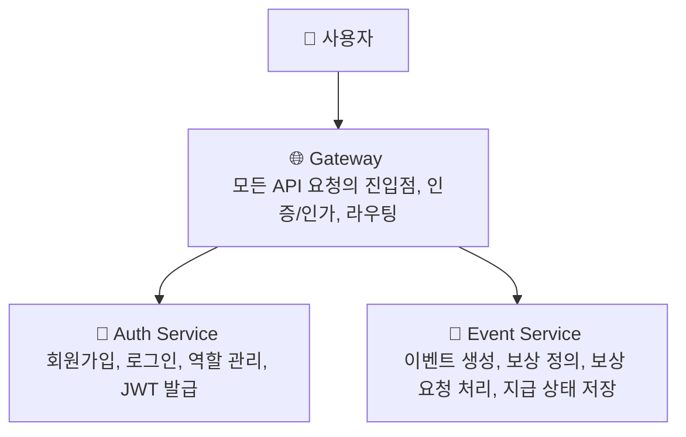

# 🎯 Event Reward System
이 레포는 이벤트 보상 시스템을 구성하는 모든 마이크로서비스가 준수해야 할
기술 컨벤션과 서비스 저장소 정보를 관리하는 저장소입니다.


## 📦 서비스 구성
각 마이크로서비스는 별도의 Git 리포지토리로 분리되어 운영됩니다.

| 서비스 이름 | 역할 | GitHub Repository |
|-------------|------|-------------------|
| **Gateway** | 모든 API 요청 진입점, 인증/인가 및 라우팅 처리 | [nexon-assignment-gateway]() |
| **Auth**    | 사용자 등록/로그인, 역할 관리, JWT 발급 | [nexon-assignment-auth]() |
| **Event**   | 이벤트 등록, 보상 정의, 보상 요청 처리 및 이력 관리 | [nexon-assignment-event]() |
| **NestJS Template** | NestJS 기반 MSA 프로젝트의 공통 템플릿 저장소 | [nexon-assignment-nestjs-temp](https://github.com/argon1025/nexon-assignment-nestjs-temp) 

> 🧠 왜 Polyrepo로 구성되었나요?
>> 본 프로젝트는 단순한 과제가 아닌 **실제 기업에서 운영 가능한 구조** 설계를 목표로 합니다.  
>> 서비스 간 책임과 의존성을 명확히 분리하고, 독립적인 배포 및 운영 환경을 제공하기 위해
각 서비스를 별도의 Git 저장소(Polyrepo)로 구성했습니다.   


---
## 🧾 공통 개발 컨벤션
모든 서비스는 아래 컨벤션을 준수해야 합니다.

### 👀 이슈 관리
Github Projects Kanban을 사용하여 이슈를 생성 및 트래킹 합니다. [링크](https://github.com/users/argon1025/projects/8)

### 📁 브랜치 전략
기본 브랜치: `main`  
개발 브랜치: `develop`  
기능 개발 브랜치: `{feature|fix}-#{이슈 번호}`  

- `Main`, `Develop` 브랜치는 리니어 하게 관리합니다.
  - 기본적으로 `squash and merge`를 권장하며, 커밋 이력을 모두 보존해야 하는 경우에만 `merge`를 사용합니다.
- 각 이슈는 별도의 브랜치에서 작업합니다.

### 📘 API 규약
- 모든 마이크로서비스는 RestAPI를 통해 통신합니다.
- 각 서비스는 반드시 `/api` 경로에 Swagger 문서를 제공해야 하며, 모든 인터페이스에는 다음 항목을 포함해 설명을 명확히 작성해야 합니다.
  - `@ApiTags`, `@ApiProperty`, `example`
- 에러 발생 시에는 적절한 HTTP 상태 코드를 사용하고, 아래와 같은 응답 형식을 반드시 준수합니다.
```json
{
  "error": {
    "name": "에러명(에러 코드)",
    "message": "에러 설명"
  }
}
```

### 🐱 기술
- 사용 언어 : `TypeScript/NestJS`
- 패키지 매니저 : `pnpm`
- 노드 버전 : `18(고정)`
- 데이터베이스 : `MongoDB`
- 배포/실행 : `Docker + docker-compose`
- 코드 스타일
  - NestJS에서 사용하는 기본 네이밍 컨벤션을 준수합니다.

---
## 🚀 Docker-compose 로컬 개발환경 구성
...
