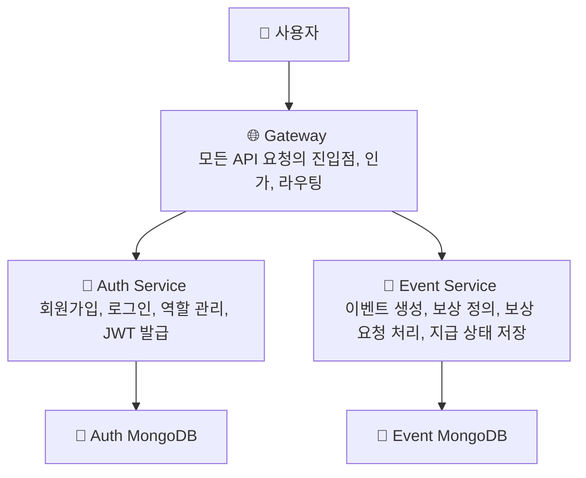

# 🎯 Event Reward System

이 레포는 이벤트 보상 시스템을 구성하는 모든 마이크로서비스가 준수해야 할
기술 컨벤션과 서비스 저장소 정보를 관리하는 저장소입니다.

## 📦 서비스 구성

각 마이크로서비스는 별도의 Git 리포지토리로 분리되어 운영됩니다.
아래 표를 통해 각 서비스별 저장소에 접근하실 수 있습니다.



| 서비스 이름         | 역할                                                | GitHub Repository                                                                         |
| ------------------- | --------------------------------------------------- | ----------------------------------------------------------------------------------------- |
| **Gateway**         | 모든 API 요청 진입점, 인증/인가 및 라우팅 처리      | [nexon-assignment-gateway](https://github.com/argon1025/nexon-assignment-gateway)         |
| **Auth**            | 사용자 등록/로그인, 역할 관리, JWT 발급             | [nexon-assignment-auth](https://github.com/argon1025/nexon-assignment-auth)               |
| **Event**           | 이벤트 등록, 보상 정의, 보상 요청 처리 및 이력 관리 | [nexon-assignment-event](https://github.com/argon1025/nexon-assignment-event)             |
| **NestJS Template** | NestJS 기반 MSA 프로젝트의 공통 템플릿 저장소       | [nexon-assignment-nestjs-temp](https://github.com/argon1025/nexon-assignment-nestjs-temp) |

> 🧠 왜 Polyrepo로 구성되었나요?
>
> > 본 프로젝트는 단순한 과제가 아닌 **실제 기업에서 운영 가능한 구조** 설계를 목표로 합니다.  
> > 서비스 간 책임과 의존성을 명확히 분리하고, 독립적인 배포 및 운영 환경을 제공하기 위해
> > 각 서비스를 별도의 Git 저장소(Polyrepo)로 구성했습니다.

---

## 🧾 공통 개발 컨벤션

모든 마이크로서비스는 아래의 개발 규칙과 스타일을 준수합니다.

### 🐱 기술

- 사용 언어 : `TypeScript/NestJS`
- 패키지 매니저 : `pnpm`
- 노드 버전 : `18(고정)`
- 데이터베이스 : `MongoDB`
- 배포/실행 : `Docker + docker-compose`
- 코드 스타일
  - airbnb-typescript
  - import 순서는 알파벳 기준 정렬, NestJS 관련 패키지는 상단에 배치

### 👀 이슈 관리

Github Projects Kanban을 사용하여 이슈를 생성 및 트래킹 합니다. [링크](https://github.com/users/argon1025/projects/8)

### 📁 브랜치 전략

기본 브랜치: `main`
기능 개발 브랜치: `{feature|fix}-#{이슈 번호}`

- `Main` 브랜치는 리니어 하게 관리합니다.
  - 기본적으로 `squash and merge`를 권장하며, 커밋 이력을 모두 보존해야 하는 경우에만 `merge`를 사용합니다.
- 각 이슈는 별도의 브랜치에서 작업합니다.
- 배포 전략에 따라 release, staging 등의 브랜치를 유연하게 추가하여 환경을 분리합니다.

### 📘 인터페이스

- 모든 서비스는 REST API 기반으로 통신합니다.
- 각 서비스는 /api 경로에 Swagger 문서를 제공해야 하며, 모든 API는 설명을 명확히 작성해야합니다.
- 에러 발생 시에는 적절한 HTTP 상태 코드를 사용하고, 아래와 같이 일관된 구조로 반환되어야 합니다

```json
{
  "error": {
    "name": "에러명(에러 코드)",
    "message": "에러 설명"
  }
}
```

### 📜 로깅전략

- 모든 요청 헤더에 `x-request-id`를 포함하여 추적이 가능하도록 지원합니다.
- 요청 및 응답 로그를 기록하여 디버깅과 모니터링을 용이하게 합니다.
  > asyncLocalStorage ClsModule을 사용합니다.

### 🐳 Docker 빌드

- 멀티 스테이지 빌드를 사용하여 빌드 용량을 최소화하고, 실행 이미지를 경량화합니다.

### ⚙️ 환경 변수

- 모든 환경의 시간대는 `UTC`로 통일합니다.
- 환경별 `.env` 파일(`.env.local`, `.env.dev`, `.env.prod`)을 통해 설정을 분리합니다.
  > NestJS ConfigModule을 사용합니다.

---

## 🚀 Docker-compose 프로젝트 통합실행 가이드

이 저장소의 DockerCompose는 Auth, Event, Gateway 마이크로서비스를 통합 실행할 수 있도록 구성되어 있습니다.  
개발자가 로컬에서 전체 MSA 흐름을 테스트할 수 있는 환경을 빠르게 구성하는 데 목적이 있습니다.

> 🔗 통합 실행 외에 개별 서비스 실행이 필요한 경우에는 각 레포의 README.md를 참고하세요.

### 1. 필요한 저장소 복제

아래 4개의 레포지토리를 동일한 디렉토리에 위치하도록 클론합니다.

```
$ git clone https://github.com/argon1025/nexon-assignment.git
$ git clone https://github.com/argon1025/nexon-assignment-auth.git
$ git clone https://github.com/argon1025/nexon-assignment-event.git
$ git clone https://github.com/argon1025/nexon-assignment-gateway.git

$ ls
/your-workspace/
 ┣ nexon-assignment/               ← 통합 docker-compose.yml 위치
 ┣ nexon-assignment-auth/
 ┣ nexon-assignment-event/
 ┗ nexon-assignment-gateway/
```

### 2. docker-compose 빌드

```
$ cd nexon-assignment
$ docker-compose build --build-arg NODE_ENV=docker
```

`nexon-assignment` 해당 레포지토리로 이동 후  
각 서비스(NestJS 앱) 및 MongoDB를 한 번에 빌드합니다.
최초 실행 또는 코드 변경 시 수행합니다.

> 빌드 과정에서 각 저장소의 `.env.docker` 환경변수 파일을 참조하여 빌드합니다.

### 3. 컨테이너 실행

```
$ docker-compose up
```

Gateway, Auth, Event 서비스 및 MongoDB가 함께 실행됩니다.

### 4. 서비스 접근

```
Gateway (전체 API 진입점) -> http://localhost/api
Auth Swagger UI -> http://localhost:8080/api
Event Swagger UI -> http://localhost:8081/api
Auth MongoDB -> mongodb://localhost:27017
Event MongoDB -> mongodb://localhost:27018
```
